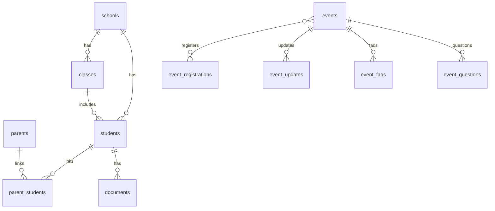

# Data Structure

This document provides a detailed overview of the database schema for the CampusCircle application, including the entity-relationship diagram (ERD) and SQL schema definitions.

## ERD (Mermaid)



## Schema SQL

The following is the SQL schema for the `campus_circle` database.

```sql
-- 001_init_schema.sql
CREATE SCHEMA IF NOT EXISTS campus_circle;

CREATE TABLE IF NOT EXISTS campus_circle.parents (
  id UUID PRIMARY KEY DEFAULT gen_random_uuid(),
  email TEXT UNIQUE NOT NULL,
  full_name TEXT NOT NULL,
  phone TEXT,
  created_at TIMESTAMPTZ DEFAULT now(),
  updated_at TIMESTAMPTZ DEFAULT now()
);

-- ... (the rest of the schema)
```
